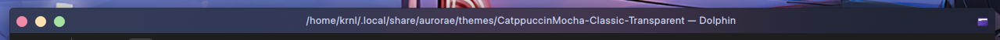

# Catppuccin Mocha Classic Transparent

A modification of [Catppuccin Mocha Classic Aurorae theme](https://github.com/catppuccin/kde), to support transparent titlebars.

Based on version 0.2.6.

## License stuff

Copy of original license is included in [LICENSE_original](LICENSE_original)
